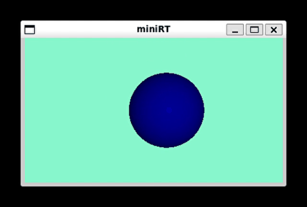

# miniRT

## Descripción

**miniRT** es un proyecto del currículo de 42 que consiste en la implementación de un **renderizador de escenas 3D mediante la técnica de trazado de rayos (ray tracing)**. El objetivo principal es comprender y aplicar los principios fundamentales de la generación de imágenes tridimensionales, incluyendo la representación de objetos geométricos simples (planos, esferas, cilindros), fuentes de luz y la interacción de los rayos de luz con estos elementos para crear imágenes realistas.

## Escenas (ficheros .rt)

Una escena en miniRT se define mediante varios elementos esenciales que describen el mundo virtual a ser renderizado. Estos componentes se especifican en un archivo de texto plano con una sintaxis particular. A continuación, se describen los principales elementos:

* **Cámara (C):** Define el punto de vista del observador. Se especifica mediante su posición (x, y, z), un vector de orientación normalizado (nx, ny, nz) y el campo de visión (FOV) en grados.

* **Luz Ambiental (A):** Define la iluminación general y constante de la escena. Se especifica mediante una relación de intensidad (entre 0.0 y 1.0) y un color en formato RGB (R, G, B) donde cada componente varía de 0 a 255.

* **Luz (L):** Representa una fuente de luz puntual en la escena. Se define por su posición (x, y, z), una relación de intensidad (entre 0.0 y 1.0) y un color en formato RGB (R, G, B).

* **Esferas (sp):** Objetos esféricos definidos por su centro (x, y, z) y su radio (r), junto con su color en formato RGB (R, G, B).

* **Planos (pl):** Superficies planas definidas por un punto en el plano (x, y, z) y un vector normal unitario (nx, ny, nz), además de su color en formato RGB (R, G, B).

* **Cilindros (cy):** Objetos cilíndricos definidos por las coordenadas de su centro (x, y, z), el vecotr unitario en la dirección del eje del cilindro, su radio (r) y su color en formato RGB (R, G, B).

### Ejemplo de una escena

Aquí se presenta un ejemplo de cómo se podría definir una escena básica en un archivo `.rt`:
```sh
A 0.2 255,255,255
C -50,0,20 0,0,-1 70
L -40,50,0 0.8 255,255,255
sp 0,0,-20 10 255,0,0
pl 0,-50,0 0,1,0 0,255,0
cy 50,0,-20 50,30,-20 5 0,0,255
```

En este ejemplo:

* Se define una luz ambiental blanca con una intensidad del 20%.
* Se coloca una cámara en la posición (-50, 0, 20), mirando en la dirección (0, 0, -1) con un campo de visión de 70 grados.
* Se añade una luz blanca con una intensidad del 80% en la posición (-40, 50, 0).
* Se crea una esfera roja con centro en (0, 0, -20) y radio 10.
* Se define un plano verde que pasa por el punto (0, -50, 0) con una normal apuntando hacia arriba (0, 1, 0).
* Se añade un cilindro azul con base en (50, 0, -20) y tapa en (50, 30, -20), con un radio de 5.

Este es solo un ejemplo básico. En la carpeta scenes se pueden encontrar diferentes escenas creadas para poder visualizarlas y el usuario puede crear todas las que quiera.

## Configuraciones del programa

Este miniRT permite ciertas configuraciones del sistema que pueden ajustarse para personalizar la experiencia de visualización.

### Tamaño de pantalla

El tamaño de la ventana de renderizado se define mediante variables en el archivo de cabecera `macros.h`.

* **`WIDTH`**: Define el ancho de la pantalla en píxeles. Puedes modificar el valor asignado a esta macro para cambiar el ancho de la ventana.
* **Relación de Aspecto**: Actualmente, la relación de aspecto está fijada en **16:9**. El alto de la ventana se calcula automáticamente en función del ancho definido y esta relación.

### Controles de cámara

El programa permite manipular la cámara mediante las siguientes teclas:

* **Teclas de Flecha (↑, ↓, ←, →)**: Desplazan la cámara horizontal y verticalmente **respecto a la orientación actual de la cámara**. Es decir, las flechas mueven la vista lateralmente y hacia arriba o abajo.

* **Teclas W, A, S, D**: Modifican la **orientación de la cámara**.
    * **W**: Rota la cámara hacia arriba.
    * **S**: Rota la cámara hacia abajo.
    * **A**: Rota la cámara hacia la izquierda.
    * **D**: Rota la cámara hacia la derecha.

* **Teclas + y -**: Controlan el **zoom** o el movimiento de la cámara en la dirección de su orientación.
    * **+**: Acerca la cámara al punto de mira (zoom in).
    * **-**: Aleja la cámara del punto de mira (zoom out).
 


## Compilación y ejecución

Para compilar el programa `miniRT`, usa el siguiente comando:

```sh
make
```

Si realizas cambios en `fractol.h`, recompila el proyecto con:

```sh
make re
```
Para borrar los objetos y el ejecutable:

```sh
make fclean
```

## Notas

- Cuanto mas grande sea la pantalla o más objetos haya en la escena, más tarda en renderizar y por lo tanto la experiencia de usuario en los movimientos se ralentiza mucho.
- Se ha utilizado como refrencia bibliogáfica el [libro](https://books.out.csli.me/NonFiction/Programming/The%20Ray%20Tracer%20Challenge-Pragmatic%20Bookshelf%20%282019%29%20-%20Jamis%20Buck.pdf) de Jamis Buck,  "The Ray Tracer Challenge: A Test-Driven Guide to Your First 3D Renderer" como referencia para programar el ray tracing.

## Ejemplos de escenas


